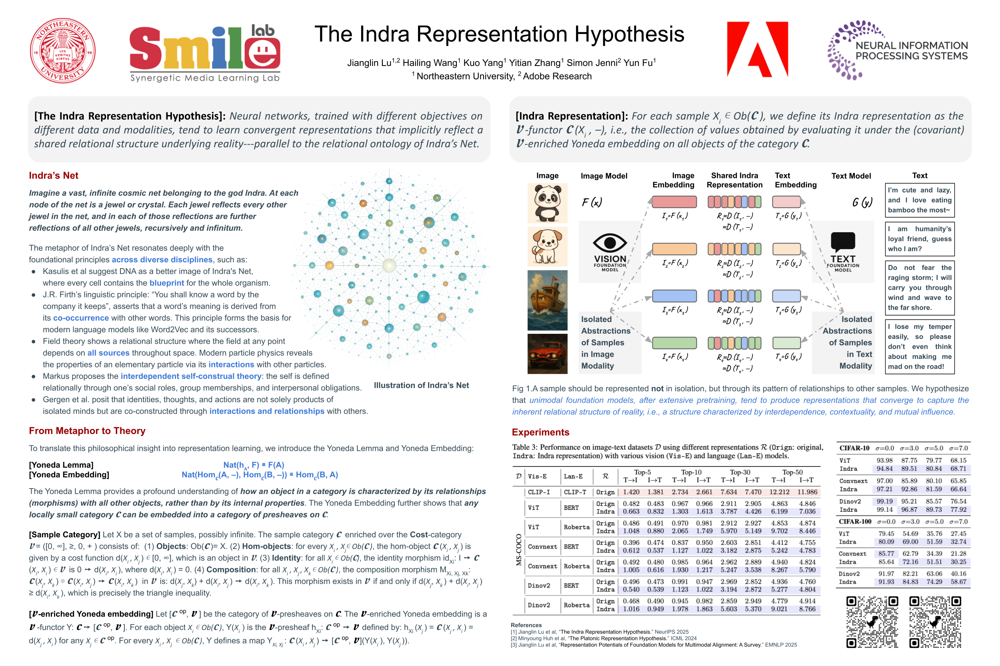

# The Indra Representation Hypothesis (NeurIPS 2025)
Code for the NeurIPS 2025 paper [The Indra Representation Hypothesis](https://openreview.net/pdf/7a234a154428f618d6232f1a153278475a2e3b00.pdf).




## Installation
```bash
bash setup_envir.sh
```

## Datasets
### MS-COCO
```bash
cd src
python download_MS_COCO.py
unzip ../datasets/MS-COCO/val2017.zip -d ../datasets/MS-COCO/
unzip ../datasets/MS-COCO/annotations_trainval2017.zip -d ../datasets/MS-COCO/
```
### NOCAPS
```bash
Download Validation Set Captions from https://nocaps.org/download
save captions at ./datasets/NOCAPS/nocaps_val_4500_captions.json
cd src
python download_NOCAPS.py
```


## Extract Features

```bash
cd src
bash extract_feats.sh
```

## Run
```bash
cd src
bash run_vlm.sh
bash run_alm.sh
bash cifar.sh
bash officehome.sh
```


# References

    @inproceedings{Jianglin2025,
      title={The Indra Representation Hypothesis},
      author={Jianglin Lu and Hailing Wang and Kuo Yang and Yitian Zhang and Simon Jenni and Yun Fu},
      booktitle={The Thirty-ninth Annual Conference on Neural Information Processing Systems},
      year={2025},
      url={https://openreview.net/forum?id=D2NR5Zq6PG}
    }

    @inproceedings{lu2025representation,
      title={Representation Potentials of Foundation Models for Multimodal Alignment: A Survey},
      author={Jianglin Lu and Hailing Wang and Yi Xu and Yizhou Wang and Kuo Yang and Yun Fu},
      booktitle={Proceedings of the 2025 Conference on Empirical Methods in Natural Language Processing},
      year={2025},
      publisher={Association for Computational Linguistics},
      url={https://aclanthology.org/2025.emnlp-main.843/}
    }

}


